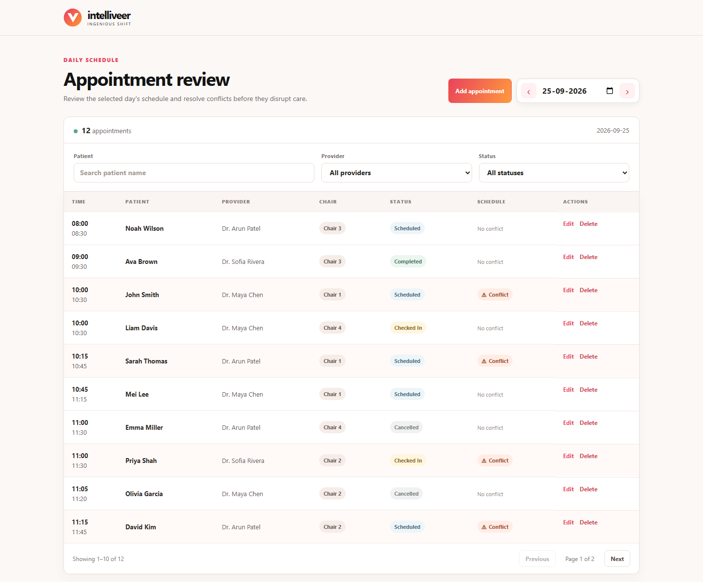
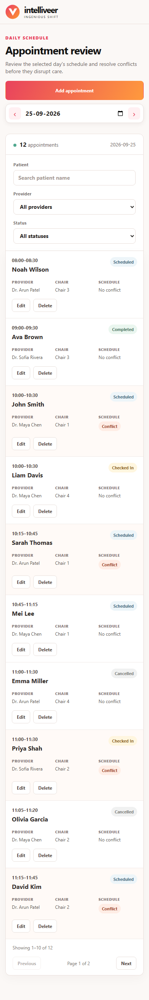
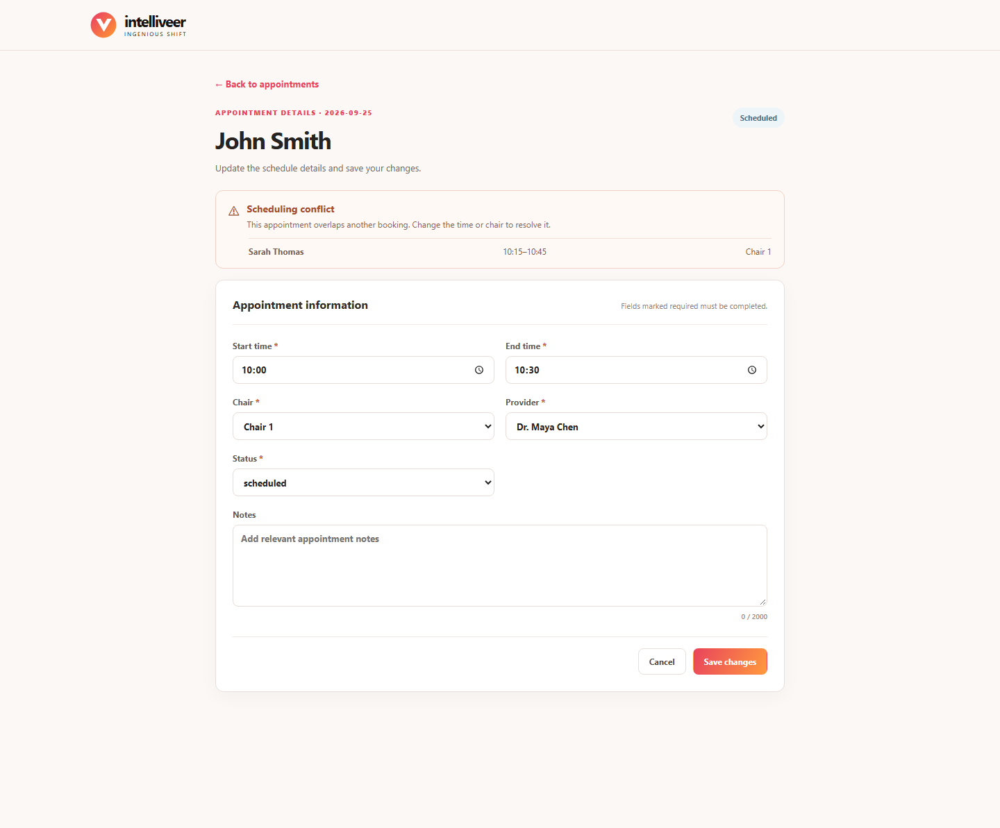
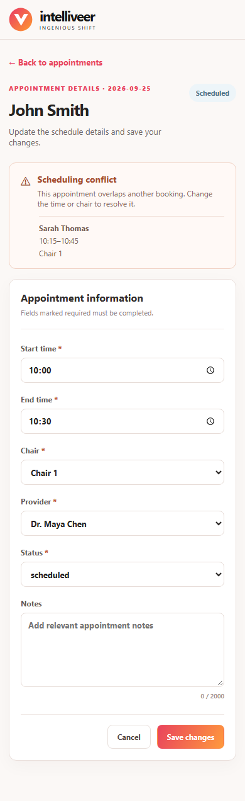

# Appointment Review

A small clinic appointment manager built with Angular and TypeScript, Node.js and Express, and MongoDB. It supports date-based appointment review, search and filters, conflict visibility, and creating, editing, and deleting appointments.

## Screenshots

### Desktop schedule



### Mobile schedule (390px viewport)



### Desktop appointment form



### Mobile appointment form (390px viewport)



## Requirements

- [Node.js](https://nodejs.org/en/download) 24.19 or newer in the 24.x series, with npm.
- [MongoDB Community Server](https://www.mongodb.com/docs/manual/administration/install-community/) installed and running locally, or a MongoDB URI you can access.

## Run locally

The included `server/.env` uses `mongodb://127.0.0.1:27017/appointment_review`. If you use another database, update `MONGODB_URI` in that file. If `server/.env` is missing, copy `server/.env.example` to `server/.env`.

From the repository root, install dependencies and seed the database:

```sh
cd server
npm install
npm run seed
```

In one terminal, start the backend:

```sh
cd server
npm run dev
```

In another terminal, start the frontend:

```sh
cd client
npm install
npm start
```

Open `http://localhost:4200`. Seeding prints a `demoDate`; use `/appointments?date=<demoDate>` to review the sample schedule and conflicts. The seed command inserts the sample providers, chairs, and appointments when they are missing.

## Tests and checks

Use Node.js 24.19.0 from `.nvmrc`. Run the repeatable check from each project directory:

```sh
# server
npm run check

# client
npm run check
```

The client check runs TypeScript checking, Vitest, a production Angular build (including template checks), and `npm audit`. The server check runs TypeScript checking, built-in unit and HTTP tests, and `npm audit`. HTTP tests use a fake MongoDB adapter and an ephemeral local server; real MongoDB persistence still needs a separately configured integration-test database. CI runs both checks on pushes and pull requests.

No code linter is configured. Strict TypeScript checks, Angular template compilation, automated tests, and dependency audits are the current gates; a linter can be added if the project adopts a consistent rule set.

## API

- `GET /api/appointments?date=YYYY-MM-DD` — required date; optional `providerId`, `status`, `search`, `page`, and `limit` filters
- `GET /api/appointments/:id`
- `POST /api/appointments` — create an appointment
- `PATCH /api/appointments/:id` — partial update of `startTime`, `endTime`, `chairId`, `providerId`, `status`, and/or `notes`
- `DELETE /api/appointments/:id` — delete an appointment
- `GET /api/providers`
- `GET /api/chairs`

List filters, count, sorting, and pagination run in MongoDB. A list item's conflict flag includes appointments hidden by the current filters or page. Invalid input returns `400`, unknown appointments return `404`, and scheduling conflicts return `409` with conflict details.

## Assumptions and scope

- Appointment dates are clinic-local `YYYY-MM-DD` values, and times are same-day 24-hour `HH:mm` values; no timezone conversion or cross-midnight booking is supported.
- Two non-cancelled appointments conflict when they use the same chair and overlap. Intervals are half-open, so adjacent appointments do not conflict.
- The seed creates 27 appointments over three days with 3 providers, 4 chairs, four statuses, and intentional conflicts. It is idempotent and only inserts missing records; it does not reset existing appointment edits.
- Authentication, notifications, drag-and-drop, and cloud deployment are outside this assignment's scope.

## Limitations and production follow-up

Conflict-check-and-update operations are serialized within one server process. Multiple API instances would need database-backed coordination to prevent concurrent conflicting writes. For production, add authentication and authorization, timezone-aware clinic scheduling, a search index for larger patient datasets, integration tests using an isolated test database, and deployment/monitoring.
